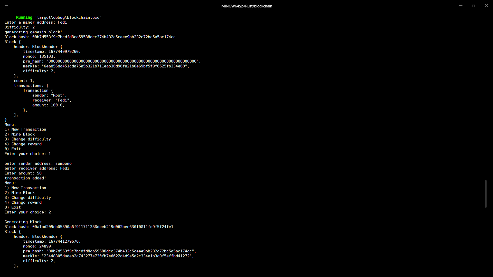
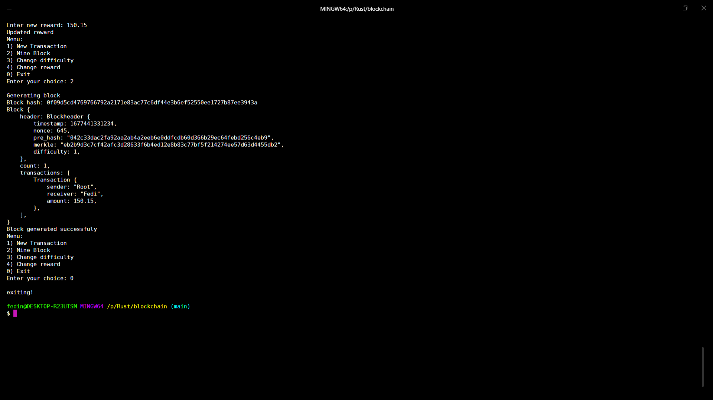

# CLI Blockcahin

## About:
- A simple blockchain created withe rsut programming language.

# Installation
**Recommended way (building from source):**\
=== *Please note: building from source takes **a lot of CPU and RAM** usage.* ===\
You need to have installed:
- [Rust](https://www.rust-lang.org/tools/install) 

If you want to or already have went through the hassle of installing Rust, you can ```git clone``` this repository, then ```cargo build --release```.

## To run the app
- ```cd Toy-Blockchain``` and run `cargo run`

# Sreenshot



